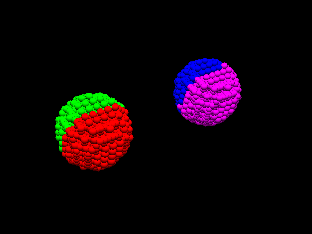
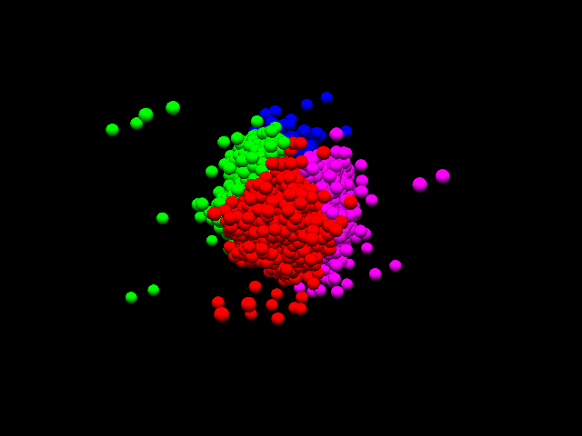
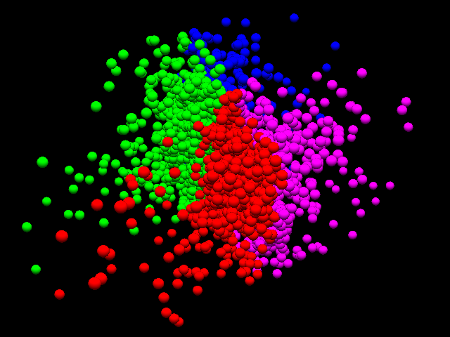

# Sample Files

## Collision

The collision of the droplets. The time evolution is performed by molecular dynamics simulations with [FDPS](https://github.com/FDPS/FDPS). The source code is available [here](https://github.com/kaityo256/fdps_sample/tree/master/step6).

    cd samples/collision
    unzip files.zip
    acv *.cd -c system_information.cfg

The above will give you following pictures.

This simulation is peformed with four threads. A different thread is denoted by different color.